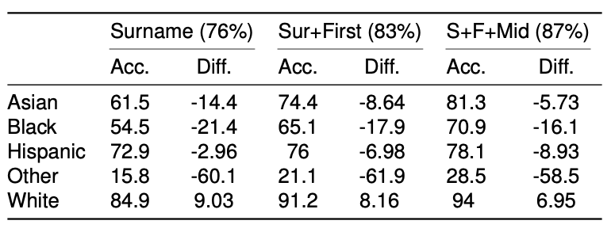

```{r setup, include=FALSE}
knitr::opts_chunk$set(echo = TRUE)
```

## Introduction

As community-oriented researchers, we are interested in understanding racial and ethnic disparities related to a wide range of issues, from health care, to educational outcomes, to political representation. In order to do this effectively, we rely on individual-level characteristics such as age, gender, and, perhaps mos importantly, race/ethnicity; yet, significant gaps exist in the collection of accurate racial and ethnic data at the population level, which often leaves us with missing data. This issue is not new to scholars as researchers have proposed a number of statistical methods to try and circumvent these obstacles for the last two decades. For this piece, however, we want to discuss one avenue to improve on the possible issue of misspecified or missing race and ethnicity data that could improve our overall work known as Bayesian Improved Surname Geocoding.  

## What is Bayesian Improved Surname Geocoding?

Bayesian Improved Surname Geocoding, or BISG, combines surname analysis with geocoded data to estimate an individual’s race. Put another way, this methodology calculates the conditional probability that an individual belongs to a particular racial group based on their name and geolocation using the US Census Bureau’s Surname list and demographic data. Running this function provides researchers with a set of new variables that provide the probability that an individual would be considered White, Black, Hispanic, Asian, or Other.

While this particular form of estimation has only recently gained popularity within the last decade, it has enjoyed a wide use across disciplines and even in the public sphere with things like election forecasting and state/federal lawsuits. This relatively quick adoption by a variety of different fields provides a good indication as to the utility of this method. However, we want to first validate the possible use of this method using the North Carolina voter file as North Carolina remains one of the few states that reports registration by race/ethnicity. In other words, we are able to check the predictions from the BISG model with the self-reported answers of registrants. 

## Accuracy (Validity)

In order to provide an accurate assessment of the BISG model, I performed three separate predictions that utilized the three different options for names: surname (last name) only, surname and first name, and surname, first, and middle name. The predictions were then compared to the self-reported race/ethnicity of the respective registrant. All of these predictions utilized Census data at the county level, though there is a possibility of utilizing lower geographical units such as the Census Tract, Block Group, or even Block if desired. The results can be found in the table below:



There is approximately an 11 percent improvement when utilizing all three names compared to just using the surname of the individual. The real issue, however, is that the accuracy of the model appears to be biased toward whites. In every model, whites are the only group that consistently outperform the mean accuracy of the model while Blacks/African Americans perform the worst. While this bias is reduced as we utilize more information in the prediction, and the overall accuracy of the model is something that provides promise for research, this underestimation of minority groups proposes a significant drawback, particular for community research. 

## Conclusions and Next Steps

While utilizing BISG provides a promising step in the right direction, we at the Urban Institute want to ensure that this is being used in the proper way. Our next step is to create a more formalized process for implementing this method, including providing documentation to both our partners and the community writ large. We also would appreciate any feedback on the use of this process, and how it can be improved moving forward. 
