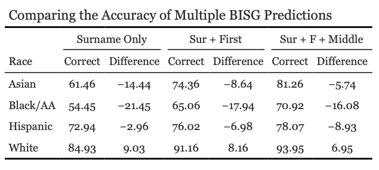

```{r setup, include=FALSE}
rm(list=ls()) # clears the environment of all objects
knitr::opts_chunk$set(echo = TRUE)

# Required Libraries
library(tidyverse)
library(stringr)
library(readr)
library(reader)
library(readxl)
library(tidyr)
library(data.table)
library(wru)
```
\vfill
\textbf{Abstract}

This paper provides a detailed walkthrough of how we validated the estimations of the wru package (R) with the publicly available voter file in North Carolina. After cleaning the dataset in a way to meet the standards of wru, we ran the predict race function using the most recently available 2020 data at the county level. Multiple estimates were calculated using a combination of the first, middle, and surname dictionaries. These various predictions are then compared to illustrate how utilizing all three of these names, even at the county level, can provide an overall accuracy of 87 percent when predicting an individual's race/ethnicity. Further examination, however, reveals that this level of accuracy is not enjoyed by every type of racial/ethnic group in the dataset.

\newpage

# Pre-requisites

## Files

The statewide voter file for North Carolina represents the only dataset used for the analysis; this publicly available dataset can be found on the North Carolina State Board of Elections website and is available across multiple years and at the county-level.

## Requirements
The following packages are required to run the analysis: 

1. tidyverse
2. data.table
3. wru

Tidyverse includes a host of different packages commonly used for data management and cleaning. This project relies on dplyr to create the dataset of interest. Data.table is a package that allows R to import large datasets more efficiently, specifically for text files, through the use of the fread command. Finally, we utilize the wru package to estimate the race/ethnicity of the various individuals within the dataset.

# Creating the Dataset

We begin using the fread function of the data.table package to import the statewide voter file from North Carolina. Fread presents a viable alternative to other methods of importing text files due to the size of the file (approximately 5 million observations). 
```{r eval=FALSE}
Undeclared <- fread("~/Data/ncvoter_Statewide.txt")
NCcounty <- fread("~/Data/Shapefiles/NCDOT_County_Boundaries.csv", 
                  select=c( "UpperCountyName", "FIPS"))

NCcounty$FIPS <- str_pad(NCcounty$FIPS, 3, pad = "0")

Undeclared <- Undeclared %>% left_join(NCcounty, 
              by = c( "county_desc" = "UpperCountyName") )
```
After successfully bringing in this file and naming it "Undeclared", we then bring in the county-level FIPS information, which will be important for acquiring the census information later. After creating a FIPS variable that has the mandatory three spaces for the values, the final line of code merges these two files together on the county name (though they are coded differently in the respective datasets) to now have the information necessary to begin cleaning the dataset. 

This begins with the code below:
```{r eval=FALSE}
Undeclared <- Undeclared %>% 
  filter(!( is.na(Undeclared$precinct_desc ) | Undeclared$precinct_desc=="" ) ) %>% 
  mutate(surname = last_name, state = "NC",
         ncpct_id = as.character(precinct_abbrv),
         sex = ifelse(gender_code %in% "F", 1, 0 ),
         PID = ifelse(party_cd %in% "DEM", 1,
                      ifelse(party_cd %in% "REP", 2, 0)),         
         nc_re = ifelse(race_code %in% "W" & ethnic_code %ni% "HL", "W",
                   ifelse(race_code %in% "B" & ethnic_code %ni% "HL", "B",
                   ifelse(ethnic_code %in% "HL", "HL",
                   ifelse(race_code %in% "A" & ethnic_code %ni% "HL", "A",
                   ifelse(race_code %ni% c("W", "B", "A") & 
                          ethnic_code %ni% "HL", "O", "M"))))) )  %>% 
  dplyr::select(state, county = FIPS, ncpct_id, ncid, surname, last_name, first = first_name, 
                middle = middle_name, nc_re, race_code, ethnic_code)  %>% 
  distinct(ncid, .keep_all = TRUE)
```
As an overview, the preceding code removes any row with missing and/or empty district (precinct_desc) values, adds new demographic variables with modified values, subsets the dataset to only include specific variables, and finally removes duplicate rows based on the ncid variable (this is the individual-level identifier provided by the NCSBE). For more informative purposes, however, we go through and explain the code in segments. 

The row beginning with the filter command removes any row where the precinct_desc variable possesses either an NA or an empty string value. This allows us to remove any observation (registrant) who is not registered in a recognized district in North Carolina. The mutate command provides the ability to create several new variables, including:

* A new surname variable with the same values as the last_name variable; in essence, this renames the variable in a way that is in line with the requirements of the wru package.
* New geographic identifiers, including a state variable with the value "NC" and a new ncpct_id variable with the precinct_abbrv variable converted to character data type.
* For demographic data not related to race/ethnicity, the following variables are created, though not included for the analysis:
  + A sex variable with values of 1 for "F" and 0 for anything else in the gender_code variable.
  + PID (party identification) variable with values of 1 for "DEM", 2 for "REP", and 0 for anything else in the party_cd variable. 
  + While these variables are not used in the predictions below, this would be the process to make the data in line with the requirements of the wru package. 
* The nc_re variable is generated using a series of nested if-else statements based on the values of the race_code and ethnic_code variables. Importantly, we create this new variable to limit individuals to having race and ethnicity classifications that are exclusive of one another. In other words, we only include White, non-Hispanics, non-Hispanic Black/African Americans, etc. 

The final task in getting the dataset in shape is to remove individuals without a classification for either race or ethnicity. While normally this would be our population of interest for imputing data, we want to eliminate these individuals for the purposes of validating our predictions later on. 

```{r eval=FALSE}
Undeclared.add <- Undeclared %>% filter(race_code %ni% c("U", " ") & 
                                        ethnic_code %ni% "UN") %>% 
  dplyr::select(-c(nc_re, race_code, ethnic_code)) 
```
The code also removes the race and ethnic variables from the dataset so the wru prediction can run. 

# Imputing Race/Ethnic Data at the Individual-level

## Using the WRU package in R
Running the BISG model to create the imputed race/ethnic data represents the next step in the process. We begin by downloading the data at the geographic unit of interest (here it is the county level in order to provide a baseline of accuracy for our estimates):
```{r eval=FALSE}
ncCensusData <- get_census_data(key = Sys.getenv("CENSUS_API_KEY"),
                states = "NC", year = "2020", census.geo = "county")

```
This code utilizes the get_census_data() function with the options to retrieve Census Bureau data for all North Carolina counties in 2020. The API key is loaded from an environment variable (footnote here explaining this process). 

We now run the predict_race() function using the Undeclared.add data frame and the Census Bureau data to generate the predicted race/ethnicity for each individual in the data frame:
```{r eval=FALSE}
Undeclared.add <- predict_race(voter.file = Undeclared.add, 
                               surname.year = 2020,
                               census.geo = "county", 
                               census.data = ncCensusData,
                               year = "2020",
                               model = "BISG",
                               names.to.use = "surname")
```
The options for the model are set as such:

* The census.geo parameter specifies that county-level data should be used. The census.data parameter is set to the ncCensusData variable, which was created in the previous line. 
* The year parameter is set to "2020", which matches the year of the Census Bureau data. 
* The model parameter is set to "BISG", which specifies the method used for the prediction. 
* The names.to.use parameter is set to "surname", which indicates that only surnames will be used for the prediction.

This will provide us with the following predictions:

## Translating the predictions into an individuals "race/ethnicity"

While the previous command provides researchers with the predicted probability of an individual's race/ethnicity across five categories, the question now becomes what to do with this information? Put another way, how do we take this information and assign a new predicted value of race/ethnicity? We answer this with the following code:
```{r eval=FALSE}
Undeclared.add <- Undeclared.add %>% 
  mutate(predict_race = colnames(Undeclared.add %>% 
         dplyr::select(pred.whi:pred.oth) )[max.col(Undeclared.add %>% 
         dplyr::select(pred.whi:pred.oth), ties.method = "random")],
         prace_new = recode(predict_race, 
                      "pred.whi" = "W",
                      "pred.bla" = "B",
                      "pred.his" = "HL",
                      "pred.asi" = "A",
                      "pred.oth" = "O")) %>%
  dplyr::select(ncid, prace_new)
```

* The mutate() function is used to add two new variables to the data frame. Predict_race is created by selecting the names of the new predicted variables (pred.whi through pred.oth) that have the highest values for each row. 
  + This is done using the colnames() and max.col() functions, with ties.method = "random" to break ties randomly. 
  + The resulting variable contains the predicted race for each individual.
* Prace_new is created by using the recode() function to, in essence, recode the values based on predict_race values. The resulting variable contains the predicted race for each row in a format consistent with the previous code example.
* The dataset is then limited to only the ncid and prace_new variables.

## Validating the predictions from WRU

The final step in the process is to check whether the predictions of the BISG model matches with the self-reported race/ethnicity of registered voters in North Carolina. To do this, we need to filter out any rows with missing or unknown data related to race or ethnicity before joining the original dataset with the new dataframe containing the predicted race/ethnicity. 

These two data frames are merged using the unique identifier for each voter:
```{r eval=FALSE}
Undeclared <- Undeclared %>% filter(race_code %ni% c("U", " ") & ethnic_code %ni% "UN") %>%
  left_join(Undeclared.add, by = "ncid" )
```

The resulting dataframe can now be used to determine the level of accuracy for the BISG predictions when it comes to the race/ethnicity of registered voters in North Carolina. To perform this validation, we run the final chunk of code:
```{r eval=FALSE}
Undeclared <-  Undeclared %>% filter(nc_re %ni% "M") %>% 
  mutate(Race_sur = ifelse(nc_re %in% "W" & prace_new %in% "W", 1, 
                    ifelse(nc_re %in% "B" & prace_new %in% "B", 1, 
                    ifelse(nc_re %in% "A" & prace_new %in% "A", 1,
                    ifelse(nc_re %in% "O" & prace_new %in% "O", 1,
                    ifelse(nc_re %in% "HL" & prace_new %in% "HL", 1, 0)))))) %>% 
  dplyr::select(-c(prace_new)) 

check <- table(Undeclared$Race_sur) 
check / sum(check) 
rm(check)
```
After filtering any rows where the race is listed as "Multiracial", We then create a new variable indicating whether the race listed in the original dataset matches the predicted race based on surname. If the original race matches the predicted race, the value of this variable is set to 1, and it is set to 0 otherwise. The final lines of code calculates the proportion of voters whose original and predicted race match and outputs this as a table. 

# Results

In order to provide an accurate assessment of the BISG model, I performed three separate predictions that utilized the three different options for names: surname (last name) only, surname and first name, and surname, first, and middle name. The predictions were then compared to the self-reported race/ethnicity of the respective registrant. All of these predictions utilized Census data at the county level, though there is a possibility of utilizing lower geographical units such as the Census Tract, Block Group, or even Block if desired. The results of the various BISG predictions and their accuracy to the self-reported identity of Whites, Blacks/African Americans, Hispanic/Latinos, and Asians is reported below.

{width=70%}

All else being equal, we see an increase of approximately 11 percent accuracy going from using surname (last names) exclusively to using the first, middle, and surname in the predictive model (76 percent predicted correctly compared to 87 percent predicted correctly, respectively). The issue, however, is that the accuracy of the model appears to be biased toward whites. In every model, whites are the only group that consistently outperform the mean accuracy of the model while Blacks/African Americans perform the worst. While this bias is reduced as we utilize more information in the prediction, and the overall accuracy of the model is something that provides promise for research, this underestimation of minority groups proposes a significant drawback, particularly for community research. 
